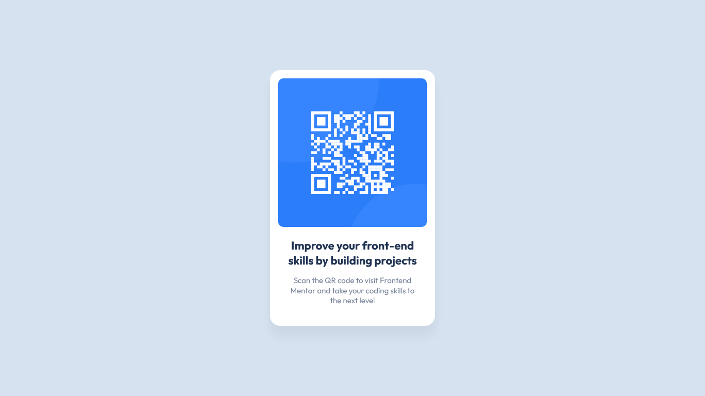

# Frontend Mentor - QR code component solution

This is a solution to the [QR code component challenge on Frontend Mentor](https://www.frontendmentor.io/challenges/qr-code-component-iux_sIO_H). Frontend Mentor challenges help you improve your coding skills by building realistic projects.

## Table of contents

- [Overview](#overview)
  - [Screenshot](#screenshot)
  - [Links](#links)
- [My process](#my-process)
  - [Built with](#built-with)
  - [What I learned](#what-i-learned)
  - [Useful resources](#useful-resources)
- [Author](#author)

## Overview

### Screenshot



### Links

- Solution URL: [Frontend Mentor](https://www.frontendmentor.io/solutions/qr-code-web-component-IsqwnjqLc2)
- Live Site URL: [GitHub Pages](https://raubaca.github.io/qr-code-component/)

## My process

### Built with

- Semantic HTML5 markup
- CSS custom properties
- CSS Grid
- [Web Components](https://developer.mozilla.org/en-US/docs/web/web_components)

### Useful resources

- [Using custom elements
  ](https://developer.mozilla.org/en-US/docs/Web/Web_Components/Using_custom_elements) - Tutorial about custom elements

### What I learned

As the title of the challenge says, the QR Code is a **component**, so I created a custom one that can be implemented as follows:

```html
<qr-code
  img="images/image-qr-code.png"
  data-title="Improve your front-end skills by building projects"
  data-text="Scan the QR code to visit Frontend Mentor and take your coding skills
      to the next level"
/>
```

## Author

- Frontend Mentor - [@raubaca](https://www.frontendmentor.io/profile/raubaca)
- Twitter - [@raubaca](https://www.twitter.com/raubaca)
- LinkedIn - [Raúl Barrera Castiblanco](https://www.linkedin.com/in/raubaca/)
- CodePen [Raúl Barrera](https://codepen.io/raubaca)
